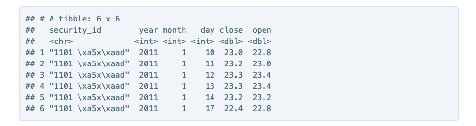

```{r setup, include=FALSE}
knitr::opts_chunk$set(echo = TRUE)
```

> 作業使用的資料檔案，請至 「Ch 2.1 - R 語言與 Tidy 資料原則 - 回顧分析流程」下載 TWSE_Stock Data_2012-2017.csv。

# 作業題目

本次的作業中，我們請工程師從公開資料源下載了「元大寶來台灣卓越50證券投資信託基金」(俗稱 0050) 成分股從 2011 年到 2015 年的股價資料，如下所示。其中每個 column 的意義：

1. security_id：每檔股票的證券代碼與名稱，如：1101 台泥 代表證券代碼為 1101，公司名稱為台泥。
2. type：open 代表開盤價，close 代表收盤價。
3. 2015/12/31：2015年12月31日當日的交易價格。
…以此類推

```{r}
library(tidyverse)
```


```{r}
TWSEStock2012_2017 <- read_csv("./TWSE_StockData_2012-2017.csv")
as.tibble(TWSEStock2012_2017) -> TWSEStock2012_2017
class(TWSEStock2012_2017)
```


## 問題 1 (Tidy 原則)

這個資料集合顯然不符合 tidy 原則，你認為這個資料集合有下列哪些問題呢？（多選）

Column 其實是值而不是變數 
把變數當成值 
多個變數儲存在同一個 column 中 
一個變數被分存在不同 columns 中

```{r}
TWSEStock2012_2017
#最理想的狀態是：股票代碼、日期、開盤價、收盤價，一共四個變數。
#問題：1 2 3 4 (感覺1/4 2/3 互為表裡？)
```


## 問題 2 (實際操作：gather 函數)

請你利用課堂教授過的 gather 函數，將資料整理成以下四個 columns 的格式（只顯示前 6 個 row），如範例資料所示。請問該資料的程式碼應該如何撰寫？（填充題，請完成空格 2.1、2.2、2.3）


```{r}
TWSEStockName <- colnames(TWSEStock2012_2017)
TWSEStock2012_2017 %>% gather(
    key = "date",
    value = "price",
    TWSEStockName[3:length(TWSEStockName)]
) -> TWSEStock2012_2017_2

head(TWSEStock2012_2017_2)
```


## 問題 3 (實際操作：spread 函數)

請你利用課堂教授過的 spread 函數，將資料整理成包含以下四個 columns 的格式：

- securty_id
- date
- open：該證券在該日期的開盤價
- close：該證券在該日期的收盤價
如範例資料所示。請問該資料的程式碼應該如何撰寫？（填充題，請完成空格 3.1、3.2）


```{r}
TWSEStock2012_2017_2 %>% spread(key = "type", value = "price") -> TWSEStock2012_2017_3
head(TWSEStock2012_2017_3)
```


## 問題 4 (實際操作：seperate 函數)

上一個問題完成後的資料集合，date 的資料裡面是 yyyy/mm/dd 的形式，我們希望將資料的年、月、日分開為三個 columns，如範例資料所示。請問該資料的程式碼應該如何撰寫？（填充題，請完成空格 4.1、4.2、4.3）



```{r}
TWSEStock2012_2017_3 %>% separate(
  col = "date",
  into = c("year", "month", "day"),
  sep = "/",
  convert = T 
#	If TRUE, will run type.convert() with as.is = TRUE on new columns. This is useful if the component columns are integer, numeric or logical. (It will convert the data to "appropriate" type under the function's evaluation.)
) -> TWSEStock2012_2017_4

head(TWSEStock2012_2017_4)
class(TWSEStock2012_2017_4)
```

## 最後補充截圖


