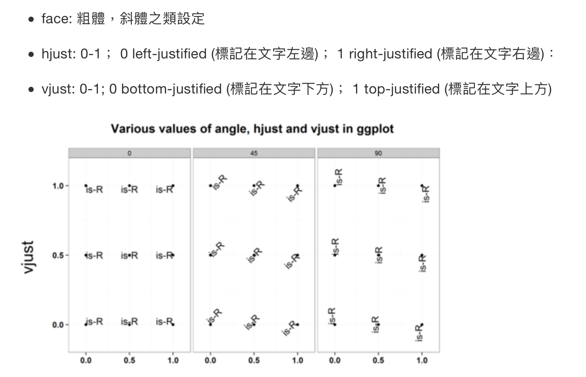

```{r setup, include=FALSE}
knitr::opts_chunk$set(echo = TRUE)
```

## Env setting
```{r}
library(tidyverse)
```

```{r}
#read as tibble
financial.data <- read_csv("./2017_financial%20index_163%20comp.csv")
```

```{r}
# financial.data %>% class()
```

讓我們來看看「財務資料集合」資料集合，你會發現所有比率的資料都是以 (%) 方式呈現。由於我們會「標準化」後再進行 PCA，所以此時不需要將這些比率除以 100。
```{r}
head(financial.data)
```


## EDA

> `summary` and `cor` are always used in EDA

```{r}
# financial.data[, 2:ncol(financial.data)] the [bracket] in tibble will output a tibble, and the $ dollar sign will output the vector.
summary(financial.data[, 2:ncol(financial.data)])
# class(summary(financial.data[, 2:ncol(financial.data)])) ## table

```

```{r}
cor(financial.data[, 2:ncol(financial.data)])
# class(cor(financial.data[, 2:ncol(financial.data)])) ## matrix
```

我通常喜歡使用 __熱圖 (heatmap)__ 視覺化變數間的相關程度，如果要使用 ggplot2 繪製相關係數的熱圖，必須先將資料整理成 tidy 的「變數 1 - 變數 2 - 相關係數」資料架構。我們可以利用 reshape2套件中的melt函數輕鬆把矩陣格式轉換成 tidy 資料。

> 熱圖：`geom_tile`

```{r}
library(reshape2)
```

```{r}
#melt, Convert an object into a molten data frame.
cor(financial.data[, 2:ncol(financial.data)])
```

```{r}
melt(cor(financial.data[, 2:ncol(financial.data)])) -> financial.data.cor.melt
```

[reference link](https://stackoverflow.com/questions/26536251/comparing-gather-tidyr-to-melt-reshape2)

`melt`和`gather`，是一組，`cast`和`spread`是一組。

之前學的是`gather`和`spread`一組，然後`separate`和`unite`一組。

前面這組，是將寬的轉成長的。後面這組，是將長的轉成寬的。

那`melt`本身是設定如果沒有`id_variable`的話，就會把全部的col壓縮到row裡面，如果你有設定`id_variable`的話，基本上就是和gather的`-c()`是相同的方式。

`cast`的寫法，反而不是很直覺，formula的左邊，是你不想動的，formula的右邊是你想要他們變成col variable的那些東西。`cast`有挑明講哪些不要動。`spread`只會講你要把哪些row content轉到col，並且將哪個col的變數作為其值。

```{r}
#use gather to duplicate the same result as melt function
as.tibble(cor(financial.data[, 2:ncol(financial.data)])) -> financial.data.cor
financial.data.cor
financial.data.cor %>% mutate(Var1 = colnames(financial.data.cor)) %>% 
  select(Var1, everything()) -> financial.data.cor.gather

financial.data.cor.gather %>% gather(key = Var2, value = value, -Var1) -> financial.data.cor.gather
```

#### compare the result of `melt` and `gather`

```{r}
financial.data.cor.melt
```

```{r}
financial.data.cor.gather
```

### Moving on to the heatmap



```{r}
ggplot(financial.data.cor.melt, aes(Var1, Var2)) + 
    geom_tile(aes(fill = value), colour = "white") +
  scale_fill_gradient2(low = "firebrick4", high = "steelblue",
                       mid = "white", midpoint = 0) +
  guides(fill=guide_legend(title="Correlation")) +
  theme_bw() +
  theme(axis.text.x = element_text(angle = 45, hjust = 1, vjust = 1), ## follow Martin's Visualization book 
        axis.title = element_blank())
```

## 資料建模與分析
首先，我們要建立 PCA 模型，可以利用 R 語言中的` prcomp` 函數。其中，如果你希望輸入的 __資料矩陣先標準化在做參數估計__，可以設定 `scales = T`。

```{r}
financial.data.cor.melt
pca.model <- prcomp(financial.data[,2:ncol(financial.data)], scale. = T)
pca.model
names(pca.model)
```

每一個模型跑完都需要`summary`的
```{r}
summary(pca.model)
```

```{r}
pca.model$sdev
pca.model$rotation
class(pca.model$rotation)
```

```{r}
pca.info <- tibble(
  PC_X = paste("PC_", c(1:length(pca.model$sdev)), sep = ""),
  sdev = pca.model$sdev^2,
  #prop
  #cum.prop
  
  # cum.sdev = for (variable in vector) {
  #                    
  #                  }
  )
pca.info
```

